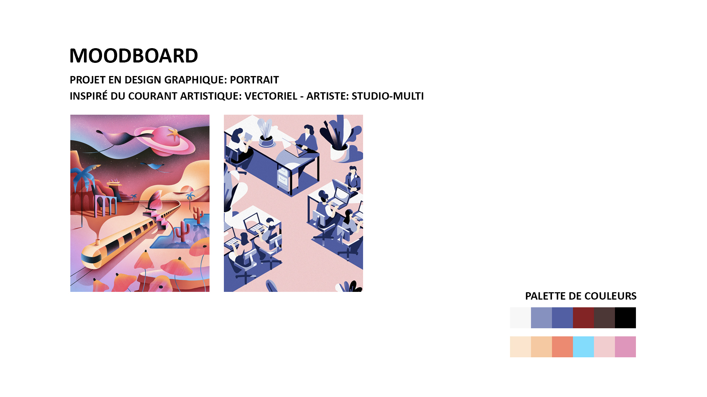
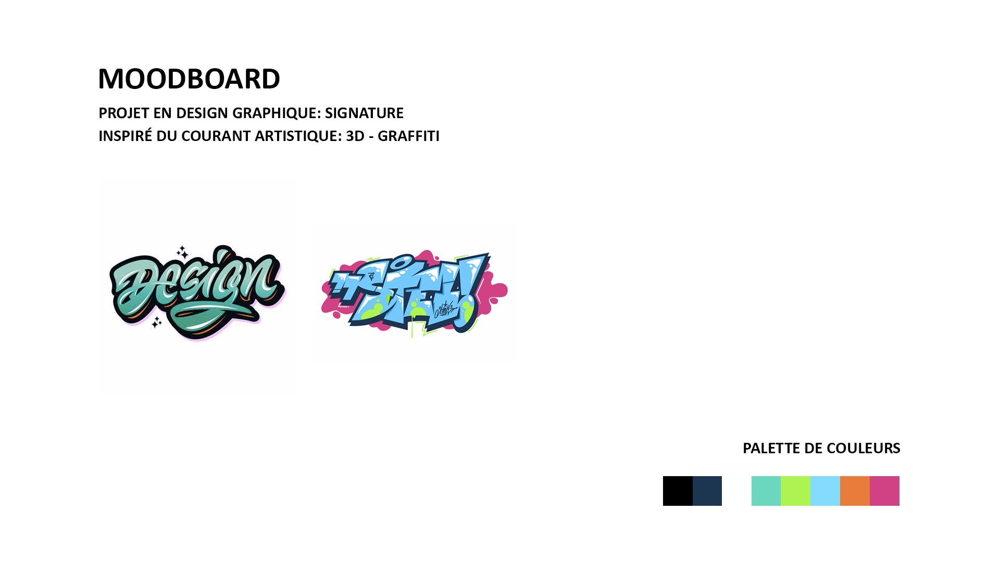
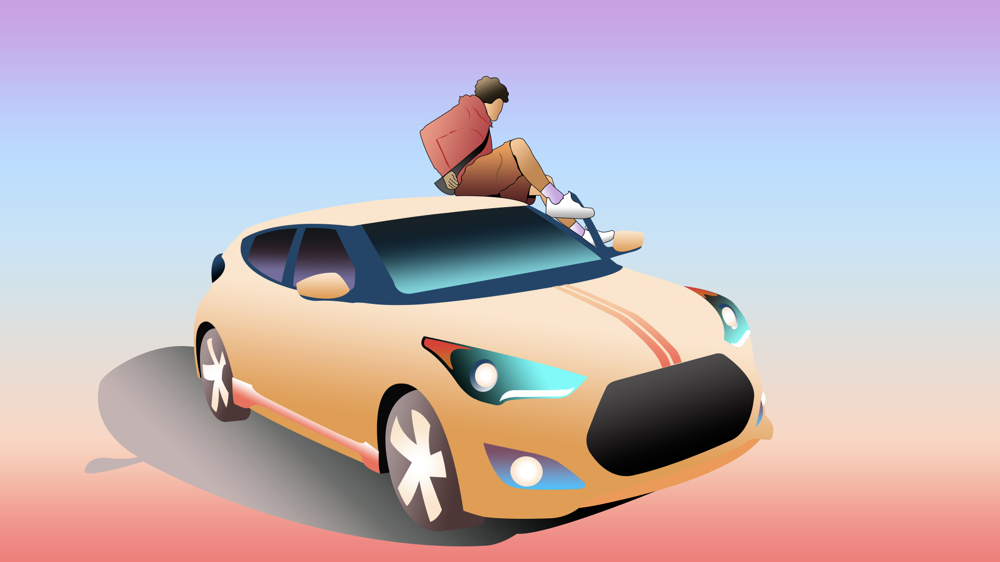
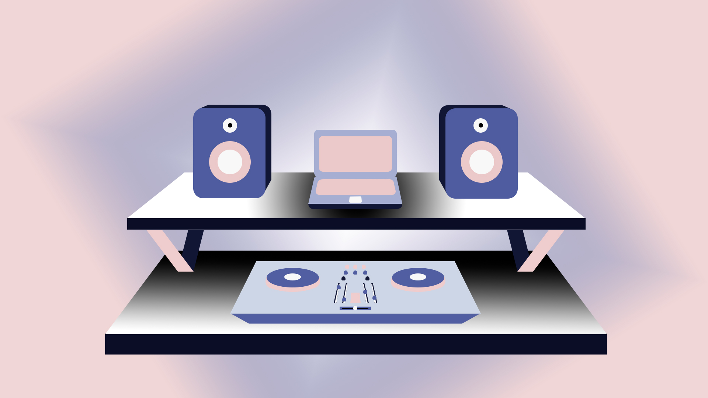
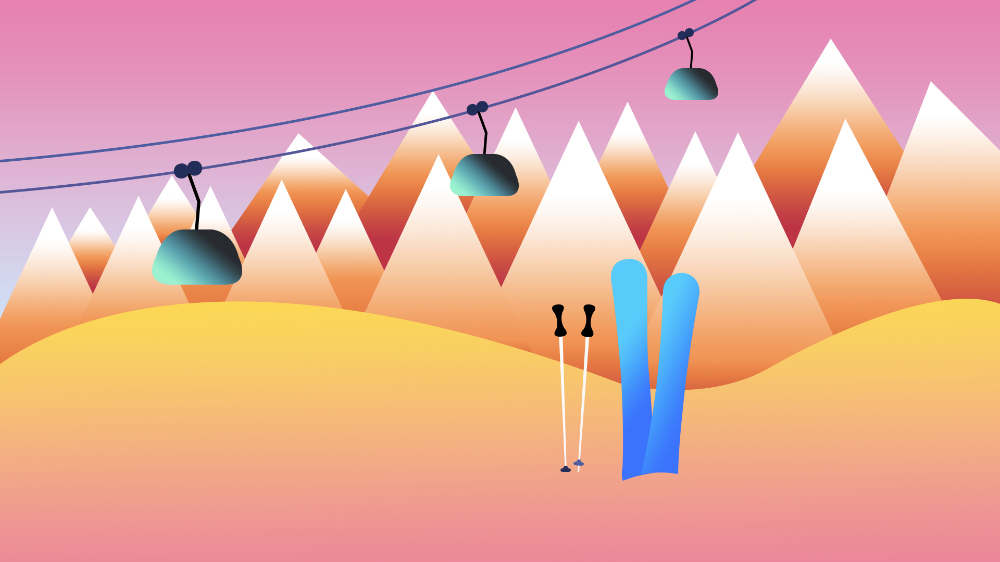
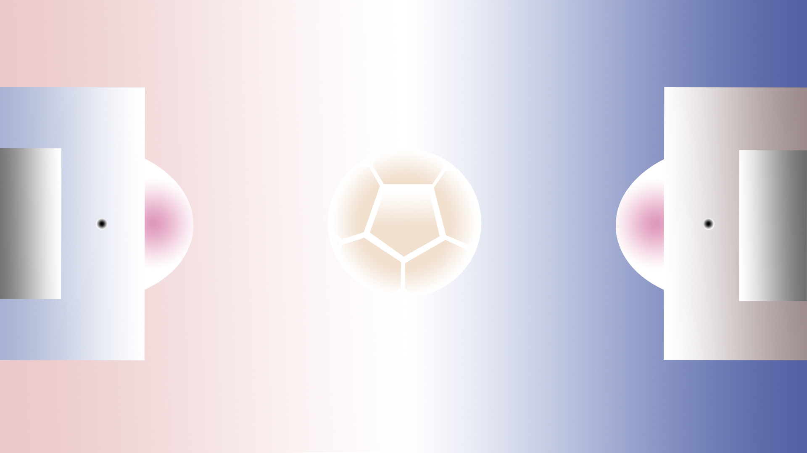
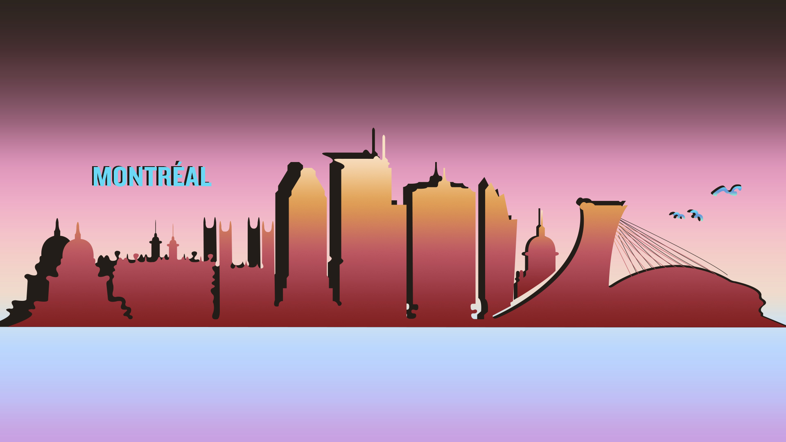
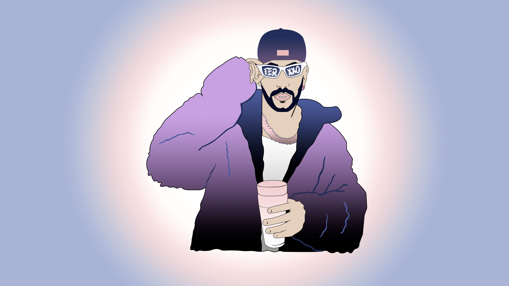

# ***Compétences***
Cochez les compétences que vous aimeriez utiliser en stage. Ajoutez-en au besoin.:     
- [x] Designer, coder et publier des sites Web dynamiques    
- [x] Réaliser et tourner des vidéos    
- [ ] Animer des créations 2D et 3D    
- [x] Concevoir des compositions sonores et visuelles interactives    
- [x] Assembler des environnements de réalité virtuelle    
- [x] Élaborer des spectacles augmentés    
- [ ] Exploiter les nouvelles technologies et leur potentiel créateur    
- [ ] Penser et optimiser l’expérience utilisateur    
- [x] Créer des univers immersifs et interactifs    
- [x] Collaborer avec diverses disciplines artistiques ou interdisciplinaires    

# ***Logiciels*** 
Cochez les logiciels avec lesquels vous êtes à l'aise. Ajoutez-en au besoin.:     
- [x] Visual Studio Code
- [ ] Photoshop
- [x] Illustrator
- [x] Lightroom
- [ ] Premiere
- [ ] Media Encoder
- [x] After Effects
- [x] Davinci Resolve
- [x] Maya
- [x] Unity
- [x] Reaper
- [ ] Ableton Live
- [ ] Max
- [ ] Arduino
- [ ] MadMapper
- [x] Microsoft Teams

# ***Langage de programmation***
Cochez les langages avec lesquels vous êtes à l'aise. Ajoutez-en au besoin.:    
- [x] HTML
- [x] CSS
- [ ] JavaScript
- [ ] PHP
- [ ] SQL
- [x] C# (Unity)
- [ ] C++ (Arduino)
- [ ] Connaissance de systèmes de gestion de contenu (CMS)

# ***Objectif de carrière***
Je souhaite obtenir un poste de créateur multimédia junior dans le domaine de la création numérique, où je pourrai utiliser mes compétences en design graphique et en modélisation 3D.

# ***Projet 1*** 
- **Nom de votre projet:** Autoportrait   
- **Mention académique ou personnel:**     
- **Réalisé dans le cadre du cours:** Illustration numérique    
- **Individuel ou en équipe:** Individuel     
- **Nom de vos coéquipiers:**      
- **Votre ou vos rôle(s) dans le projet:**     
- **Logiciels ou techniques utilisées:** Adobe Photoshop   
- **Catégorie du projet:**      
- **Description courte du projet (Résumé en 1 phrase):**     
- **Description du projet (Qu'est-ce que le prof vous a demandé de réaliser?) (2 phrases):**     
- **Description de votre projet (Qu'est-ce que vous avez fait?) (2 phrases):**    
- **Lien vers la documentation de votre projet (photos, vidéos, extraits sonores, ...):**

  
  
  

  
  
  

  
  
  

 

# ***Projet 2*** 
- **Nom de votre projet:**     
- **Mention académique ou personnel:**     
- **Réalisé dans le cadre du cours:**        
- **Individuel ou en équipe:**     
- **Nom de vos coéquipiers:**      
- **Votre ou vos rôle(s) dans le projet:**     
- **Logiciels ou techniques utilisées:**    
- **Catégorie du projet:**      
- **Description courte du projet (Résumé en 1 phrase):**     
- **Description du projet (Qu'est-ce que le prof vous a demandé de réaliser?) (2 phrases):**     
- **Description de votre projet (Qu'est-ce que vous avez fait?) (2 phrases):**     
- **Lien vers la documentation de votre projet (photos, vidéos, extraits sonores, ...):**      

# ***Projet 3*** 
- **Nom de votre projet:**     
- **Mention académique ou personnel:**     
- **Réalisé dans le cadre du cours:**        
- **Individuel ou en équipe:**     
- **Nom de vos coéquipiers:**      
- **Votre ou vos rôle(s) dans le projet:**     
- **Logiciels ou techniques utilisées:**    
- **Catégorie du projet:**      
- **Description courte du projet (Résumé en 1 phrase):**     
- **Description du projet (Qu'est-ce que le prof vous a demandé de réaliser?) (2 phrases):**     
- **Description de votre projet (Qu'est-ce que vous avez fait?) (2 phrases):**     
- **Lien vers la documentation de votre projet (photos, vidéos, extraits sonores, ...):**     

# ***Projet 4***
- **Nom de votre projet:**     
- **Mention académique ou personnel:**     
- **Réalisé dans le cadre du cours:**        
- **Individuel ou en équipe:**     
- **Nom de vos coéquipiers:**      
- **Votre ou vos rôle(s) dans le projet:**     
- **Logiciels ou techniques utilisées:**    
- **Catégorie du projet:**      
- **Description courte du projet (Résumé en 1 phrase):**     
- **Description du projet (Qu'est-ce que le prof vous a demandé de réaliser?) (2 phrases):**     
- **Description de votre projet (Qu'est-ce que vous avez fait?) (2 phrases):**     
- **Lien vers la documentation de votre projet (photos, vidéos, extraits sonores, ...):**     

# ***Projet 5 (Optionnel)***
- **Nom de votre projet:**     
- **Mention académique ou personnel:**     
- **Réalisé dans le cadre du cours:**        
- **Individuel ou en équipe:**     
- **Nom de vos coéquipiers:**      
- **Votre ou vos rôle(s) dans le projet:**     
- **Logiciels ou techniques utilisées:**    
- **Catégorie du projet:**      
- **Description courte du projet (Résumé en 1 phrase):**     
- **Description du projet (Qu'est-ce que le prof vous a demandé de réaliser?) (2 phrases):**     
- **Description de votre projet (Qu'est-ce que vous avez fait?) (2 phrases):**     
- **Lien vers la documentation de votre projet (photos, vidéos, extraits sonores, ...):**     

# ***Projet 6 (Optionnel)***
- **Nom de votre projet:**     
- **Mention académique ou personnel:**     
- **Réalisé dans le cadre du cours:**        
- **Individuel ou en équipe:**     
- **Nom de vos coéquipiers:**      
- **Votre ou vos rôle(s) dans le projet:**     
- **Logiciels ou techniques utilisées:**    
- **Catégorie du projet:**      
- **Description courte du projet (Résumé en 1 phrase):**     
- **Description du projet (Qu'est-ce que le prof vous a demandé de réaliser?) (2 phrases):**     
- **Description de votre projet (Qu'est-ce que vous avez fait?) (2 phrases):**     
- **Lien vers la documentation de votre projet (photos, vidéos, extraits sonores, ...):**       

# ***Processus de création***
- **Sélectionnez un de vos projets et insérez son processus de création. À l'aide d'images et de texte vous devez nous expliquer le processus de création étape par étape de votre projet.**

